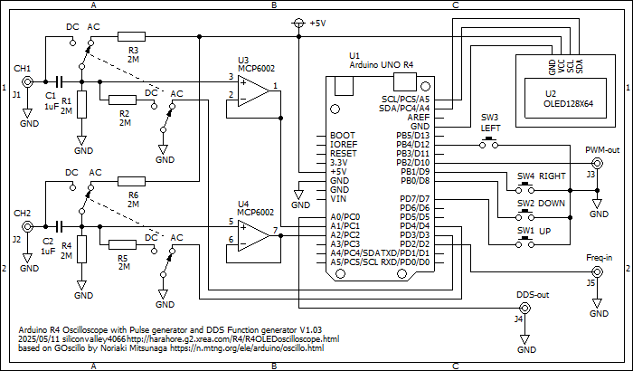

# R4OLEDOscilloscope
Arduino UNO R4 Minima OLED dual channel oscilloscope with Pulse Generator, DDS Function Generator

This displays an oscilloscope screen on a 128x64 OLED.
The settings are controled by the 4 tactile switches.
It contains Pulse Generator, DDS Function Generator.

Specifications:
<li>Dual input channel</li>
<li>Input voltage range 0 to 5.0V</li>
<li>12 bit ADC 346 ksps single channel, 141 ksps dual channel</li>
<li>timebase magnification x2, x5 and x10 applying sin(x)/x interpolation</li>
<li>Measures minimum, maximum and average values</li>
<li>Measures frequency and duty cycle</li>
<li>Spectrum FFT analysis</li>
<li>Sampling rate selection</li>
<li>Built in Pulse Generator</li>
<li>Built in DDS Function Generator</li>
 

Develop environment is: 
Arduino IDE 1.8.19 
Arduino UNO R4 Boards by Arduino version 1.3.2 
Arduino UNO R4 Minima 
CPU speed 48MHz 

Libraries: 
Adafruit_SSD1306 version 2.5.13 
Adafruit_SH110X version 2.1.12 
arduinoFFT by Enrique Condes 2.0.0 

Schematics: 

Description is here, although it is written in Japanese language:
https://ss1.xrea.com/harahore.g2.xrea.com/R4/R4OLEDOscillo.html
